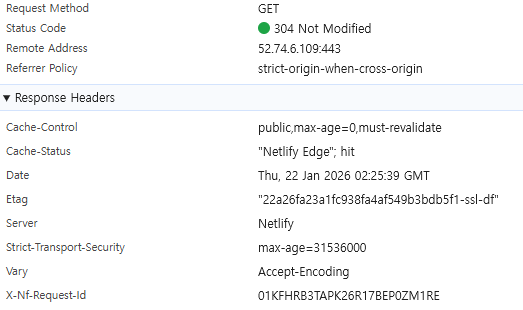
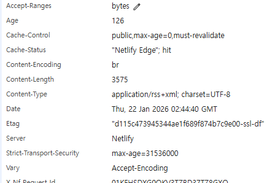

## Astro RSS 한글이 진짜로 깨졌다

블로그 운영하면서 제일 당황스러운 순간이 언제냐면,  
**"어제까진 잘 됐는데 오늘 갑자기 이상해"** 이럴 때입니다.

저는 Astro로 블로그 만들고 Netlify로 배포 중인데,  
어느 날 RSS 피드를 확인하다가 진짜 식은땀이 났어요.

**RSS 한글이 깨져 있었습니다.**

단순히 "보기만 이상한" 게 아니라  
실제로 한글 인코딩이 깨져서 검색봇이 제대로 읽을 수 없는 상태였어요.

---

## RSS 한글 깨짐, 왜 문제인가?

"RSS 하나쯤이야…" 할 수도 있는데  
생각보다 RSS는 중요합니다.

### RSS가 깨지면 생기는 문제

- 구글/네이버 검색봇이 새 글을 못 가져감
- RSS 리더 구독자들이 내용을 못 읽음
- 자동 포스팅 봇 연동 시 오류 발생
- 전문성/신뢰도가 떨어져 보임

특히 저는 **구글 서치 콘솔에 RSS를 등록**해서  
새 글이 빨리 색인되도록 설정해놨는데,

RSS가 깨지면 이게 다 무용지물이 되는 거죠.

---

## 처음엔 내 코드 문제인 줄 알았다

RSS가 이상하다는 걸 발견하고  
처음 든 생각은 이거였어요.

> "내가 뭔가 잘못 건드렸나?"

그래서 했던 삽질들:

### 1) 글 내용 문제인가?

- 특정 글에서 복붙한 특수문자 때문인가?
- 이모지가 문제인가?
- 제목에 특수기호 때문인가?

→ **아니었습니다.** 모든 글이 다 깨져 있었어요.

### 2) Astro RSS 설정 문제인가?

```javascript
// src/pages/rss.xml.js 확인
import rss from '@astrojs/rss';

export async function GET(context) {
  return rss({
    title: '블로그 제목',
    description: '설명',
    site: context.site,
    items: posts.map((post) => ({
      title: post.data.title,
      description: post.data.description,
      // 여기 문제인가?
    })),
  });
}
```

→ **코드는 정상**이었습니다.

### 3) 로컬에서는 어떻게 나오나?

```bash
npm run dev
```

로컬 개발 서버에서 `http://localhost:4321/rss.xml` 확인했더니  
**한글이 정상적으로 나왔습니다.**

이때부터 진짜 혼란스러웠어요.

> "로컬은 되는데 배포만 안 되면 뭐가 문제지?"

---

## 개발자도구로 원인 찾기 시작

감으로 해결하려다간 시간만 날리니까  
체계적으로 확인하기로 했습니다.

### 1단계: 배포 상태 확인

Netlify 대시보드 확인:
- ✅ 최근 배포 Published 상태
- ✅ 빌드 로그 에러 없음
- ✅ RSS 파일 정상 생성됨

배포는 문제없었습니다.

### 2단계: Response Headers 확인 (핵심!)

브라우저에서 RSS 열고  
F12 → Network 탭 → rss.xml 클릭



**여기서 문제를 발견했습니다.**

```
Content-Type: application/xml
```

`charset=UTF-8`이 **없었어요!**

정상적인 RSS 헤더는 이래야 합니다:



```
Content-Type: application/rss+xml; charset=UTF-8
```

바로 이게 문제였습니다.

---

## Astro RSS 한글 깨짐 원인

### 왜 로컬은 되고 배포는 안 됐을까?

**로컬 개발 서버 (Vite):**
- 자동으로 UTF-8 인코딩 처리
- Content-Type 헤더를 알아서 잘 설정

**Netlify 배포:**
- 기본 Content-Type이 `application/xml`로만 설정됨
- **charset 명시가 없으면 브라우저/봇이 인코딩을 잘못 해석**
- 한글이 깨져서 보임

### RSS 한글 깨짐 vs XML 포맷 문제

많은 사람들이 헷갈리는 부분:

❌ **"XML이 한 줄로 나와서 깨진 거 같아요"**
→ 이건 정상입니다. XML은 원래 포맷팅 안 되어도 됨

✅ **"한글이 ??? 또는 □□□로 나와요"**
→ 이게 진짜 인코딩 문제입니다

✅ **"특수문자가 이상하게 나와요"**
→ charset 설정 문제일 확률 높음

---

## Netlify RSS 한글 깨짐 해결 방법

해결 방법은 의외로 간단했습니다.

### netlify.toml 파일 생성/수정

프로젝트 루트에 `netlify.toml` 파일을 만들고  
다음 내용을 추가하세요:

```toml
[[headers]]
  for = "/rss.xml"
  [headers.values]
    Content-Type = "application/rss+xml; charset=UTF-8"
```

### 왜 application/rss+xml인가?

`application/xml`로도 작동은 하지만:

- ✅ `application/rss+xml`이 **RSS 표준 MIME 타입**
- ✅ RSS 리더들이 더 정확하게 인식
- ✅ 검색봇이 "이게 RSS 피드구나" 명확히 판단

**가장 중요한 건 `charset=UTF-8`을 명시하는 겁니다.**

---

## 설정 후 확인 방법

### 1) 배포하고 캐시 클리어

```bash
git add netlify.toml
git commit -m "fix: RSS Content-Type 헤더 설정"
git push
```

배포 후 **반드시 캐시 클리어**:

- Netlify 대시보드 → Deploys → Trigger deploy → Clear cache and deploy
- 또는 브라우저 하드 리프레시 (`Ctrl + Shift + R`)

⚠️ **주의:** 304 Not Modified 상태로 보이면 캐시된 거라 정확한 확인 안 됩니다.  
반드시 200 OK 상태로 만들어서 확인하세요.

### 2) Headers 다시 확인

F12 → Network → rss.xml

이제 이렇게 나와야 정상:

```
Status Code: 200 OK
Content-Type: application/rss+xml; charset=UTF-8
```

### 3) RSS 검증 툴로 확인

[W3C Feed Validation Service](https://validator.w3.org/feed/)

여기에 내 RSS 주소 넣고 검증:

✅ **"This is a valid RSS feed"** 나오면 성공!

### 4) 실제 한글 확인

RSS 내용에서 한글이 정상적으로 보이는지:

```xml
<item>
  <title>겨울 면역력 영양제 추천</title>
  <description>겨울철 면역력을 높이는...</description>
</item>
```

이렇게 한글이 깨지지 않고 나오면 완전히 해결된 겁니다!

---

## Astro RSS 설정 체크리스트

비슷한 문제 겪고 있다면 이 순서로 확인하세요:

```
✅ 1단계: RSS 파일이 정상 생성되는지 확인
   - 로컬: http://localhost:4321/rss.xml
   - 배포: https://도메인.com/rss.xml

✅ 2단계: Response Headers 확인
   - F12 → Network → rss.xml 클릭
   - Status Code: 200 OK (304 아님!)
   - Content-Type에 charset=UTF-8 있는지

✅ 3단계: netlify.toml 설정
   - 루트에 netlify.toml 파일 생성
   - Content-Type 헤더 명시적 설정

✅ 4단계: 캐시 클리어 후 재배포
   - Netlify에서 캐시 클리어
   - 브라우저 하드 리프레시

✅ 5단계: RSS 검증
   - W3C Validator로 유효성 검증
   - 실제 한글 내용 확인
```

---

## RSS 관련 자주 묻는 질문

### Q1. RSS가 꼭 필요한가요?

필수는 아니지만 **있으면 확실히 좋습니다**:

- 구글 서치 콘솔 RSS 제출 → 색인 속도 UP
- RSS 리더 사용자 구독 가능
- 자동 포스팅 봇 연동 가능
- 블로그 전문성 향상

### Q2. application/xml vs application/rss+xml 차이?

- `application/xml`: 범용 XML 파일
- `application/rss+xml`: RSS 전용 MIME 타입 (권장)

둘 다 작동하지만 **RSS는 application/rss+xml 쓰는 게 표준**입니다.

### Q3. charset=UTF-8 왜 필요한가요?

한글, 중국어, 일본어 등 **유니코드 문자**를 제대로 표시하려면  
명시적으로 UTF-8 인코딩을 선언해야 합니다.

없으면 브라우저/봇이 잘못된 인코딩으로 해석해서 깨집니다.

### Q4. 다른 파일도 같은 방식으로 설정 가능한가요?

네! netlify.toml에서 여러 파일 설정 가능:

```toml
[[headers]]
  for = "/sitemap.xml"
  [headers.values]
    Content-Type = "application/xml; charset=UTF-8"

[[headers]]
  for = "/robots.txt"
  [headers.values]
    Content-Type = "text/plain; charset=UTF-8"
```

### Q5. Vercel이나 다른 호스팅은요?

**Vercel:**
```json
// vercel.json
{
  "headers": [
    {
      "source": "/rss.xml",
      "headers": [
        {
          "key": "Content-Type",
          "value": "application/rss+xml; charset=UTF-8"
        }
      ]
    }
  ]
}
```

**Cloudflare Pages:**
```toml
# _headers 파일
/rss.xml
  Content-Type: application/rss+xml; charset=UTF-8
```

---

## 비슷한 문제들

이 방법으로 해결 가능한 다른 문제들:

### Sitemap 한글 깨짐

```toml
[[headers]]
  for = "/sitemap*.xml"
  [headers.values]
    Content-Type = "application/xml; charset=UTF-8"
```

### JSON Feed 한글 깨짐

```toml
[[headers]]
  for = "/feed.json"
  [headers.values]
    Content-Type = "application/json; charset=UTF-8"
```

---

## 삽질하면서 배운 것들

### 1) "로컬 정상 = 배포 정상" 아니다

개발 환경과 프로덕션 환경은 다릅니다.  
특히 **헤더 설정, 인코딩, 캐시** 같은 건 환경마다 달라요.

### 2) 문제 해결은 "확인 → 원인 → 해결" 순서로

감으로 이것저것 건드리면 더 꼬입니다.  
개발자도구로 정확히 **원인을 먼저 파악**하세요.

### 3) 캐시는 언제나 함정

설정 바꿨는데 안 되는 것 같으면  
**99% 캐시 문제**입니다.

반드시:
- 하드 리프레시 (`Ctrl + Shift + R`)
- 시크릿 모드로 확인
- Netlify 캐시 클리어

### 4) 헤더는 명시적으로 설정하자

"기본값이 알아서 해주겠지" → ❌  
"내가 직접 명시하자" → ✅

특히 국제화(i18n) 지원하는 사이트면  
**charset은 반드시 명시**하세요.

---

## 마무리

Astro RSS 한글 깨짐 문제,  
생각보다 원인은 간단했습니다.

**Netlify에서 Content-Type 헤더에 charset=UTF-8 설정 안 해서.**

하지만 이걸 찾기까지:
- 코드 문제인 줄 알고 삽질하고
- 로컬은 되는데 배포만 안 돼서 혼란스럽고
- 캐시 때문에 고쳤는지 안 고쳤는지 헷갈리고

진짜 멘탈 나가는 과정이었어요.

다음에 비슷한 문제 생기면  
이제는 **개발자도구 → Headers 확인**부터 할 겁니다.

그게 가장 빠르고 정확한 방법이더라고요.