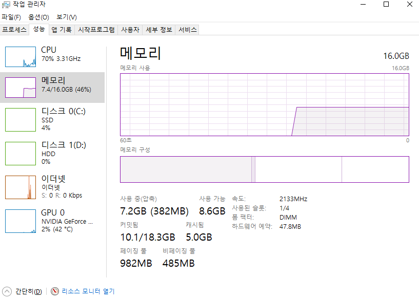
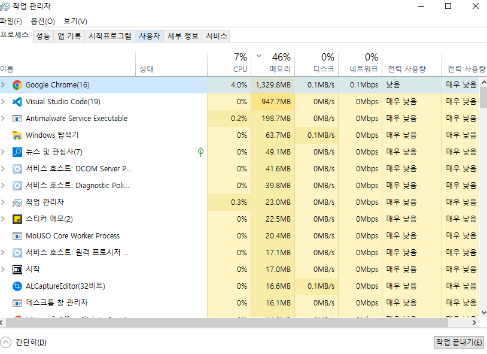
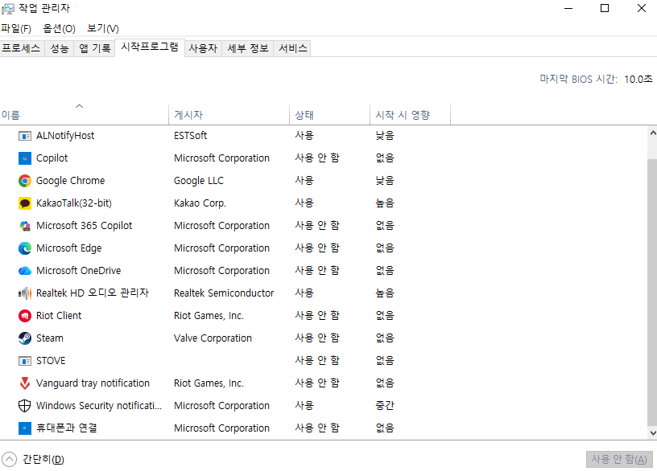

import CoupangDisclosure from '../../../components/CoupangDisclosure.astro';
import CoupangLink from '../../../components/CoupangLink.astro';

<CoupangDisclosure />

노트북이 갑자기 느려지거나 프로그램이 응답하지 않는 경험, 한 번쯤 있으시죠? 이는 대부분 **노트북 메모리 부족** 때문입니다.

오늘은 프로그램 설치 없이 **노트북 메모리 정리 하는 법** 5가지를 초보자도 따라할 수 있도록 쉽게 알려드릴게요. 지금 바로 시작해볼까요?

## 1. 내 노트북 메모리 확인하는 방법

먼저 **노트북 메모리 사용량**이 얼마나 되는지 확인해봐야겠죠?

### 메모리 사용률 확인하기

**단축키:** `Ctrl + Shift + Esc`

작업 관리자가 열리면 "성능" 탭을 클릭하고, 왼쪽에서 "메모리"를 선택하세요.



화면을 보시면:
- 총 메모리 용량 (예: 8GB, 16GB)
- 현재 사용 중인 용량
- 사용률 퍼센트 (%)

**메모리 사용률이 80% 이상**이라면 지금 바로 정리가 필요한 상태입니다!

💡 **Tip:** **노트북 메모리 8기가**를 쓰고 계신다면 6.4GB 이상 사용 중일 때, **노트북 메모리 16g**이라면 12.8GB 이상일 때 정리해주세요.

---

## 2. 방법 1: 불필요한 프로그램 종료 (메모리 사용량 줄이기)

**노트북 메모리 사용량 줄이기**의 가장 기본적이고 효과적인 방법입니다.

### 따라하기

📌 **단계별 가이드:**
```
1. 작업 관리자 → "프로세스" 탭 클릭
2. "메모리" 열 클릭 (많이 쓰는 순으로 정렬)
3. 사용하지 않는 프로그램 찾기
4. 프로그램 선택 후 "작업 끝내기" 버튼 클릭
```



### 주로 메모리를 많이 쓰는 프로그램들

- **Chrome / Edge 브라우저** (탭 많이 열었을 때)
- **카카오톡, 디스코드** (백그라운드 실행)
- **음악/동영상 플레이어**
- **게임 클라이언트** (리그오브레전드, 스팀 등)

⚠️ **주의:** "시스템", "Windows 프로세스" 등은 건드리지 마세요! 윈도우가 비정상 작동할 수 있습니다.

💡 **효과:** 이 방법만으로도 메모리 사용률을 **20~30% 즉시 감소**시킬 수 있어요!

---

## 3. 방법 2: 시작 프로그램 정리 (메모리 최적화)

부팅할 때 자동으로 실행되는 프로그램들이 **메모리 부족**의 주범입니다.

### 시작프로그램 정리하기

📌 **단계별 가이드:**
```
1. 작업 관리자 → "시작프로그램" 탭 클릭
2. "시작 프로그램 영향" 열 확인
3. 불필요한 프로그램 선택
4. "사용 안 함" 버튼 클릭
5. 노트북 재부팅
```



### 사용 안 함 해도 되는 프로그램

✅ **안전하게 끌 수 있는 것들:**
- 메신저 (카카오톡, 라인 등)
- 클라우드 동기화 (OneDrive, Google Drive)
- 업데이트 프로그램
- 음악/동영상 플레이어
- 게임 런처

❌ **끄면 안 되는 것들:**
- 그래픽 드라이버 (NVIDIA, AMD, Intel)
- 사운드 드라이버 (Realtek)
- Windows 보안
- 터치패드/키보드 드라이버

💡 **효과:** 재부팅 후 부팅 속도가 빨라지고, **기본 메모리 사용량이 10~20% 감소**합니다!

이 방법만으로도 **노트북 메모리 최적화** 효과를 바로 체감할 수 있어요.

---

## 4. 방법 3: 디스크 정리로 메모리 늘리기

임시 파일이 쌓이면 가상 메모리를 사용하는 공간이 줄어들어 메모리 부족 현상이 생깁니다.

### 디스크 정리 실행하기

📌 **단계별 가이드:**
```
1. 윈도우 검색창에 "디스크 정리" 입력
2. C 드라이브 (시스템) 선택
3. 정리할 항목 체크:
   ✅ 임시 인터넷 파일
   ✅ 다운로드 폴더
   ✅ 휴지통
   ✅ 임시 파일
4. "확인" 버튼 클릭
5. "파일 삭제" 확인
```

💡 **참고:** 디스크 정리는 저장공간을 비우는 작업이지만, 이를 통해 가상 메모리(페이지 파일) 공간이 확보되어 **노트북 메모리 늘리기** 효과가 있습니다.

---

## 5. 방법 4: 가상 메모리 설정 (고급)

윈도우의 가상 메모리를 늘려 **메모리 부족** 문제를 완화할 수 있어요.

### 가상 메모리란?

RAM이 부족할 때 하드디스크/SSD의 일부를 메모리처럼 사용하는 기술입니다.

### 가상 메모리 늘리기

📌 **단계별 가이드:**
```
1. 윈도우 검색창에 "시스템 정보" 입력
2. "고급 시스템 설정" 클릭
3. "성능" → "설정" 버튼
4. "고급" 탭 → "가상 메모리" → "변경" 클릭
5. "자동으로 관리" 체크 해제
6. C 드라이브 선택
7. "사용자 지정 크기" 선택
   - 처음 크기: 물리적 RAM × 1.5배
   - 최대 크기: 물리적 RAM × 3배
   예) 8GB RAM → 처음 12288MB, 최대 24576MB
8. "설정" → "확인"
9. 재부팅
```

⚠️ **주의:** SSD 수명이 약간 줄어들 수 있으므로, 물리적 메모리 추가가 근본적인 해결책입니다.

---

## 6. 방법 5: 노트북 메모리 정리 프로그램 (선택)

**노트북 메모리 정리 프로그램**을 사용하는 방법도 있습니다.

### 추천 프로그램

1. **CCleaner** (무료)
   - 임시 파일 정리
   - 레지스트리 정리
   - 시작프로그램 관리

2. **Wise Memory Optimizer** (무료)
   - 원클릭 메모리 정리
   - 자동 정리 기능
   - 가벼운 용량

### 하지만...

⚠️ **대부분의 경우 윈도우 기본 기능만으로 충분합니다!**

위 1~4번 방법을 먼저 시도해보시고, 그래도 불편하다면 프로그램을 사용하세요.

💡 **추가 프로그램은 오히려 메모리를 더 차지**할 수 있으니 신중하게 선택하세요.

---

## 7. 그래도 안 되면? 메모리 추가/업그레이드

위 방법을 모두 써도 메모리 사용률이 항상 **90% 이상**이라면, 물리적으로 **노트북 메모리 추가**가 필요합니다.

### 내 노트북에 맞는 메모리 확인

- 현재 **노트북 메모리 8기가** → 16기가로 업그레이드
- 현재 **노트북 메모리 16g** → 32기가로 업그레이드

### 어떤 용량이 필요할까?

| 용도 | 권장 용량 |
|------|----------|
| 문서 작업, 인터넷 | 8GB |
| 사진/영상 편집 | 16GB |
| 게임, 전문 작업 | 32GB |
| 개발, 영상 작업 | 64GB |

### 가성비 메모리 추천

**노트북 메모리 업그레이드**를 고려 중이시라면 아래 제품들을 추천드려요:

💡 **제품 선택 가이드**
- 안정성 최우선 → 삼성전자 정품
- 가성비 + 품질 균형 → 크루셜 (가장 인기)
- 가격 부담 최소화 → 삼성칩 사용 제품

<CoupangLink
  title="삼성전자 노트북용 DDR4 16GB"
  url="https://link.coupang.com/a/dDK17v"
  description="삼성전자 정품으로 안정성 검증! 16GB로 업그레이드하고 쾌적하게 사용하세요"
/>

<CoupangLink
  title="마이크론 Crucial 노트북 DDR4 16GB"
  url="https://link.coupang.com/a/dDKL94"
  description="세계 3위 반도체 기업 마이크론의 크루셜 브랜드! 평생 보증에 가성비까지. 가장 인기 있는 선택입니다"
/>

<CoupangLink
  title="삼성 칩 노트북 램16기가 DDR4 16GB"
  url="https://link.coupang.com/a/dDLeKv"
  description="삼성칩 사용! 칩은 믿을 수 있고 가격은 저렴한 가성비 제품"
/>

### ⚠️ 구매 전 필수 확인사항

**노트북 메모리 (RAM)** 구매 전 꼭 확인하세요!

1. **DDR4 vs DDR5 호환성**
   - 내 노트북 사양 확인 필수
   - CPU-Z 프로그램으로 확인 가능

2. **최대 지원 용량**
   - 노트북마다 다름 (보통 32GB~64GB)
   - 제조사 홈페이지에서 확인

3. **SO-DIMM 규격 확인**
   - 노트북용은 반드시 "SO-DIMM" 또는 "노트북용" 표시
   - 데스크탑용(DIMM)과 크기가 다름 (물리적으로 장착 불가)

4. **메모리 슬롯 개수**
   - 2개: 교체 필요
   - 4개: 추가 가능

5. **클럭 속도**
   - DDR4: 2666MHz, 3200MHz
   - DDR5: 4800MHz, 5600MHz

💡 **Tip:** 쿠팡 상품 상세페이지에 "호환성 확인" 기능이 있으니 활용하세요!

---

## 8. 자주 묻는 질문 (FAQ)

### Q1. 인터넷에서 노트북 메모리 정리 프로그램을 추천하던데, 꼭 필요한가요?

**A.** 윈도우 기본 기능만으로 충분합니다.

추가 프로그램 설치는 오히려 메모리를 더 차지하고, 일부 프로그램은 광고나 불필요한 기능이 포함되어 있어요.

이 글에서 소개한 1~4번 방법을 먼저 시도해보세요!

### Q2. 삼성 노트북 메모리 정리 방법이 따로 있나요?

**A.** 모든 브랜드 동일합니다.

삼성, LG, 레노버, HP, 델 등 모든 브랜드가 윈도우 운영체제를 사용하기 때문에 정리 방법은 동일해요.

다만 메모리 업그레이드 시 브랜드별로 호환되는 메모리 규격이 다를 수 있으니 확인이 필요합니다.

### Q3. 메모리 정리는 얼마나 자주 해야 하나요?

**A.** 노트북이 느려질 때마다, 또는 1~2주에 한 번 권장합니다.

시작프로그램 정리는 한 번만 해두면 되지만, 불필요한 프로그램 종료는 수시로 해주는 것이 좋아요.

### Q4. 8기가로 충분한가요? 16기가 필요한가요?

**A.** 용도에 따라 다릅니다.

- **8GB 충분:** 문서 작업, 인터넷, 유튜브
- **16GB 권장:** 포토샵, 영상 편집, 가벼운 게임
- **32GB 이상:** 전문 영상 편집, AAA 게임, 개발 작업

현재 메모리 사용률이 항상 90% 이상이라면 업그레이드를 고려하세요.

### Q5. 메모리 정리하면 데이터가 삭제되나요?

**A.** 아니요, 안전합니다!

메모리(RAM)는 임시 저장공간이라 정리해도 하드디스크/SSD에 저장된 파일, 문서, 사진 등은 전혀 영향받지 않아요.

다만 실행 중인 프로그램은 종료되므로 저장 안 한 작업이 있다면 먼저 저장하세요!

---

## 마무리

오늘은 **노트북 메모리 정리 방법** 5가지를 알아봤습니다.

### 핵심 요약

1. ✅ 작업 관리자로 메모리 사용량 확인
2. ✅ 불필요한 프로그램 종료
3. ✅ 시작프로그램 정리
4. ✅ 디스크 정리로 공간 확보
5. ✅ 가상 메모리 설정 (선택)
6. ✅ 그래도 안 되면 메모리 추가

이 방법들로 **노트북 메모리 부족** 문제를 해결하고 **노트북 메모리 사용량 줄이기**에 성공하셨길 바랍니다!

특히 **노트북 메모리 최적화**는 정기적으로 해주는 것이 좋으니, 이 글을 북마크해두고 필요할 때마다 참고하세요! 😊