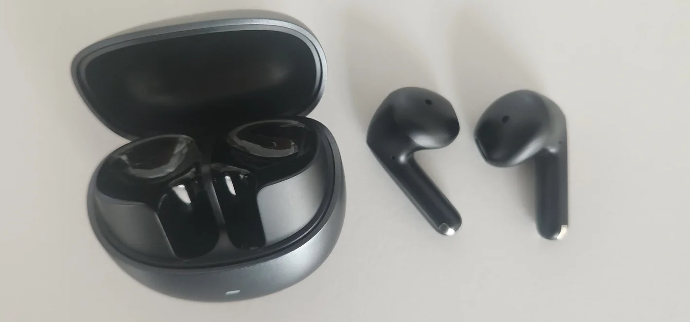
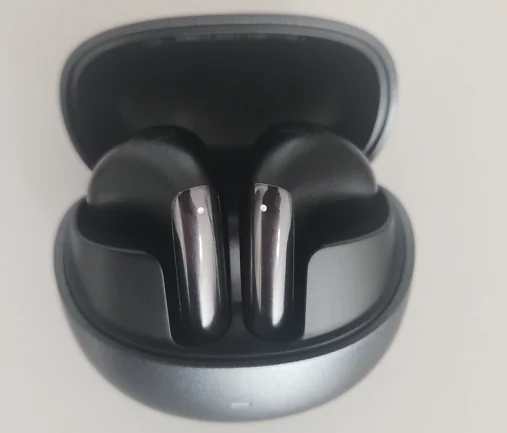
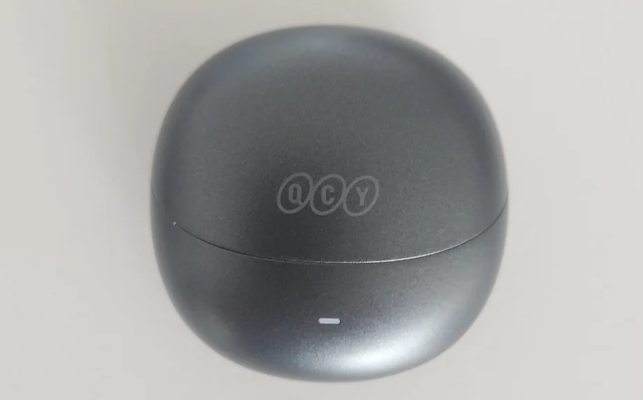

import CoupangDisclosure from '../../../components/CoupangDisclosure.astro';
import CoupangLink from '../../../components/CoupangLink.astro';

커널형 이어폰을 오래 끼고 있으면 귀가 답답하거나 외이도염이 걱정되는 분들이 많습니다. 저도 예전에 외이도염으로 고생한 뒤로 커널형을 피하게 됐는데, 그렇다고 에어팟 4를 사자니 20만 원이 넘고, 일반 오픈형은 노이즈캔슬링이 없죠.

QCY 에일리버즈 프로(AilyBuds Pro, HT10)는 3만 원대에 오픈형 + ANC + 멀티포인트를 다 갖춘, 꽤 독특한 포지션의 이어폰입니다. 실제로 구매해서 한 달 정도 쓴 후기를 솔직하게 정리해 봅니다.

<CoupangDisclosure />

## 스펙 요약

| 항목 | 에일리버즈 프로 (HT10) |
|---|---|
| **형태** | 오픈형 (세미 오픈) |
| **블루투스** | 5.3 |
| **ANC** | 적응형 ANC 지원 |
| **코덱** | SBC, AAC |
| **배터리 (이어폰)** | ANC ON 약 4h / OFF 약 5.5h |
| **총 재생시간 (케이스 포함)** | ANC ON 약 23h / OFF 약 30h |
| **방수** | IPX4 |
| **멀티포인트** | ✅ |
| **게이밍 모드** | ✅ (저지연) |
| **ENC 마이크** | 6개 |
| **충전** | USB-C |
| **무게** | 이어폰 약 4g (편측) |

> **참고:** LDAC를 지원하는 상위 모델 **에일리버즈 프로+(HT10-Hires)** 도 있습니다. LDAC 유무 외에 나머지 기능은 동일하며, 현재 쿠팡 로켓직구 기준으로 오히려 Pro보다 저렴합니다. 자세한 비교는 아래에서 다룹니다.

## 실물 사진

{/* 실제 이미지 경로로 교체하세요 */}

이어폰 줄기 부분에 금속 재질 코팅이 되어 있어서 가격 대비 마감이 꽤 고급스럽습니다. 전체적으로 에어팟 3세대와 비슷한 실루엣입니다.

뚜껑을 열면 이어폰이 세로로 세워져 있는 구조입니다. 자석이 강해서 톡 던져 넣으면 알아서 착 붙습니다. 꺼낼 때도 줄기 부분을 잡으면 편하게 빠집니다.

케이스는 QCY 로고가 새겨진 둥근 조약돌 형태입니다. 손에 쥐면 꽤 컴팩트하고, 무게도 가벼워서 주머니에 넣고 다니기 부담 없습니다.

## 착용감 – 이 이어폰을 산 이유

솔직히 이 이어폰을 산 가장 큰 이유는 **커널형을 피하고 싶어서**였습니다. 예전에 외이도염으로 고생한 이후로 귓속을 막는 이어폰이 부담스러웠거든요.

한 달 써본 결론부터 말하면, 착용감은 이 제품의 가장 큰 강점입니다. 오픈형이라 귓속을 막지 않으니 장시간 착용해도 답답하지 않고, 주변 소리도 자연스럽게 들립니다.

다만 QCY 오픈형의 특징상 **에어팟 4보다 이어폰 크기가 조금 큽니다.** 귓바퀴가 작은 분은 피팅감이 달라질 수 있으니, 처음에 착용 각도를 이리저리 조절해 보는 걸 추천합니다. 귀에 얼마나 밀착되느냐에 따라 ANC 성능도 크게 달라지기 때문입니다.

운동할 때도 써봤는데 흘러내리지 않고 잘 고정됩니다. 안경을 쓰는데 간섭도 없었습니다. 이 두 가지가 걱정이셨던 분이라면 안심하셔도 됩니다.

## 노이즈캔슬링(ANC) – 솔직히 말하면

에일리버즈 프로의 ANC는 적응형 방식입니다. 주변 소음 환경에 맞춰 자동으로 강도를 조절해 줍니다.

솔직하게 말하면 **한 달 동안 카페, 사무실, 집에서 써보면서 ANC의 극적인 차이를 느끼지는 못했습니다.** 없는 것보다는 낫다는 느낌은 있지만, "와, 소음이 확 줄었다"는 체감은 아니었습니다. 오픈형의 구조적 한계이기도 하고, 귀에 얼마나 밀착되느냐에 따라 체감이 천차만별이라는 커뮤니티 의견도 많습니다.

다만 이건 기대치의 문제이기도 합니다. 커널형 ANC처럼 외부 소음을 확 차단하는 걸 기대하면 실망할 수 있지만, **이 이어폰의 핵심은 ANC가 아니라 "오픈형인데 ANC도 있다"는 점**입니다. 오픈형의 편안한 착용감을 유지하면서 약간의 소음 감소 효과까지 얻는 것, 이 정도로 기대하면 적절합니다.

**주의할 점이 하나 있습니다.** 이어폰을 뺐다가 다시 끼면 ANC가 꺼져 있습니다. 매번 수동으로 켜줘야 하는데(오른쪽 이어폰 길게 터치), 이건 좀 불편합니다.

## 음질 – 막귀 기준 무난

음질에 민감한 편이 아니라서 전문적인 평가는 어렵습니다. 하지만 한 달간 유튜브, 음악, 팟캐스트를 들으면서 불편하거나 부족하다고 느낀 적은 없었습니다.

커뮤니티에서는 QCY 앱에서 적응형 EQ를 켜면 음질이 확 좋아진다는 의견이 많은데, 저는 앱을 따로 설치하지 않고 기본 상태로 사용했습니다. 그래도 일상적인 용도로는 충분했습니다. 다만 이건 음질에 예민하지 않은 사용자 기준이니, 음질을 중요하게 보는 분이라면 앱 설정을 꼭 해보시길 권합니다.

> **💡 팁:** QCY 앱에서 ANC + 적응형 EQ를 둘 다 켜면 음질이 눈에 띄게 좋아진다는 후기가 많습니다. 음질이 아쉽다고 느끼신다면 앱 설정부터 해보세요.

## 통화 품질

6개의 ENC 마이크가 탑재되어 있어서 가격 대비 통화 품질은 괜찮습니다. 한 달 동안 실제 통화에 여러 번 사용했는데, 상대방이 음질에 대해 불편함을 느끼지 못했습니다. 조용한 실내 기준으로는 충분히 쓸 만한 수준입니다.

## 배터리 – 유일하게 아쉬운 부분

ANC 켠 상태에서 약 4시간, 끄면 약 5.5시간입니다. 솔직히 짧습니다. 커뮤니티 후기를 보면 ANC + 적응형 EQ 둘 다 켜면 **체감 2~3시간**이라는 의견도 있습니다.

케이스 포함 총 재생시간은 ANC ON 기준 23시간이니, 수시로 케이스에 넣어 충전하면서 쓰는 패턴이 됩니다. 출퇴근용이나 짧은 운동용으로는 충분하지만, 장시간 연속 사용에는 적합하지 않습니다.

## 멀티포인트 – 되긴 하는데

노트북과 스마트폰에 동시 연결하는 멀티포인트를 지원합니다. 다만 전환이 자동이 아닙니다. 한쪽에서 미디어 재생을 수동으로 멈추고 2~3초 기다려야 다른 쪽으로 넘어갑니다. 에어팟처럼 매끄럽진 않지만, 이 가격대에서 멀티포인트 자체가 있다는 건 큰 메리트입니다.

## Pro vs Pro+ 어떤 걸 살까?

| 항목 | AilyBuds Pro (HT10) | AilyBuds Pro+ (HT10-Hires) |
|---|---|---|
| **가격** | 약 31,500원 | 약 27,840원 |
| **배송** | 로켓배송 (1~2일) | 로켓직구 (약 5일) |
| **LDAC** | ❌ | ✅ |
| **배터리 (ANC ON)** | 약 4h | 약 4h |
| **배터리 (ANC OFF)** | 약 5.5h | 약 5h |
| **나머지 기능** | 동일 | 동일 |

사실 저는 Pro를 먼저 샀는데, 글을 쓰면서 가격을 비교해 보니 LDAC까지 지원하는 Pro+가 오히려 더 저렴했습니다. Pro+가 싼 이유는 로켓직구(해외배송)라서 배송이 5일 정도 걸리기 때문입니다.

**결론: 급하게 필요한 게 아니라면 Pro+가 더 나은 선택입니다.** 가격도 싸고, LDAC 코덱까지 지원하니까요. 다만 LDAC을 켜면 멀티포인트를 쓸 수 없고, 아이폰에서는 LDAC 자체가 지원되지 않으니 참고하세요. 로켓배송으로 빨리 받고 싶은 분을 위해 제가 구매한 Pro 링크도 함께 남겨둡니다.

<CoupangLink
  title="QCY 에일리버즈 프로 플러스 (HT10 골드라벨)"
  url="https://link.coupang.com/a/dHLHWC"
  description="LDAC 코덱 | 오픈형 ANC | 멀티포인트 | IPX4 방수 | 로켓직구 약 27,840원"
/>

<CoupangLink
  title="QCY 에일리버즈 프로 (HT10)"
  url="https://link.coupang.com/a/dHL6nH"
  description="오픈형 ANC | 멀티포인트 | IPX4 방수 | 로켓배송 약 31,500원"
/>

## 이런 분에게 추천합니다

**커널형이 불편한 분** — 오픈형이라 귀를 막지 않아 장시간 착용에 유리합니다. 외이도염이 걱정되는 분에게도 좋은 선택입니다.

**에어팟 4가 부담스러운 분** — 오픈형 ANC를 에어팟 4의 1/5 가격에 경험할 수 있습니다.

**사무실·재택근무용** — 주변 소리를 완전히 차단하지 않으면서 적당히 소음을 줄여주는 용도로 딱입니다. 통화 품질도 무난합니다.

**이런 분에게는 비추천합니다**

**배터리가 중요한 분** — ANC ON 4시간은 확실히 짧습니다. 긴 배터리가 필요하면 커널형인 [멜로버즈 시리즈](/blog/qcy-melobuds-series-comparison)를 추천합니다.

**음질을 최우선으로 보는 분** — 오픈형 구조상 저음 표현에 한계가 있습니다. 음질 우선이라면 커널형인 멜로버즈 N70이 더 적합합니다.

## QCY 앱 설정 가이드

에일리버즈 프로를 제대로 쓰려면 QCY 앱 설치를 권장합니다. 저처럼 앱 없이 써도 기본적인 사용에는 문제없지만, 음질과 ANC을 최대한 끌어올리고 싶다면 앱 설정이 도움됩니다.

1. **앱 설치:** 앱스토어/플레이스토어에서 "QCY" 검색 후 설치
2. **기기 연결:** 이어폰을 착용한 상태에서 앱을 열면 자동 인식됩니다
3. **적응형 EQ 켜기:** 사운드 설정에서 적응형 EQ를 활성화하세요. 음질이 눈에 띄게 좋아진다는 후기가 많습니다
4. **ANC 모드 설정:** 노이즈캔슬링 / 패스쓰루 / OFF 중 선택 가능
5. **터치 컨트롤 변경:** 기본 터치 동작을 원하는 대로 커스터마이징할 수 있습니다

> 앱 연결 속도가 빠르지 않습니다. 인내심을 가지고 기다려 주세요.

## 마치며

QCY 에일리버즈 프로는 "3만 원대 오픈형 ANC"라는 틈새를 정확하게 공략한 제품입니다. ANC의 체감 효과나 배터리는 기대치를 낮춰야 하지만, 커널형이 불편한 사람에게는 가격 대비 이만한 선택지가 현재로서는 거의 없습니다.

한 줄로 요약하면, **"ANC 이어폰이 아니라 오픈형 이어폰인데 ANC도 되는 것"** 으로 기대하면 만족스러운 제품입니다.

커널형이 괜찮으신 분이라면 같은 QCY의 [멜로버즈 시리즈 비교 가이드](/blog/qcy-melobuds-series-comparison)도 함께 참고해 보세요.

<CoupangDisclosure />