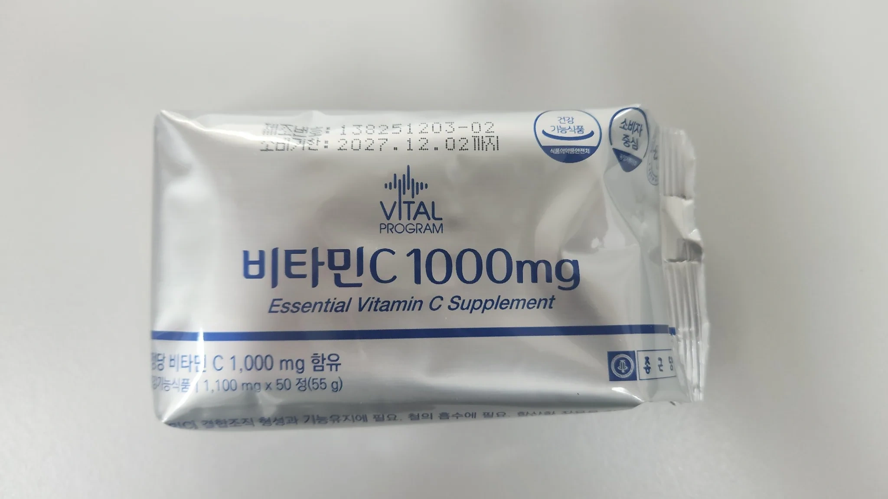
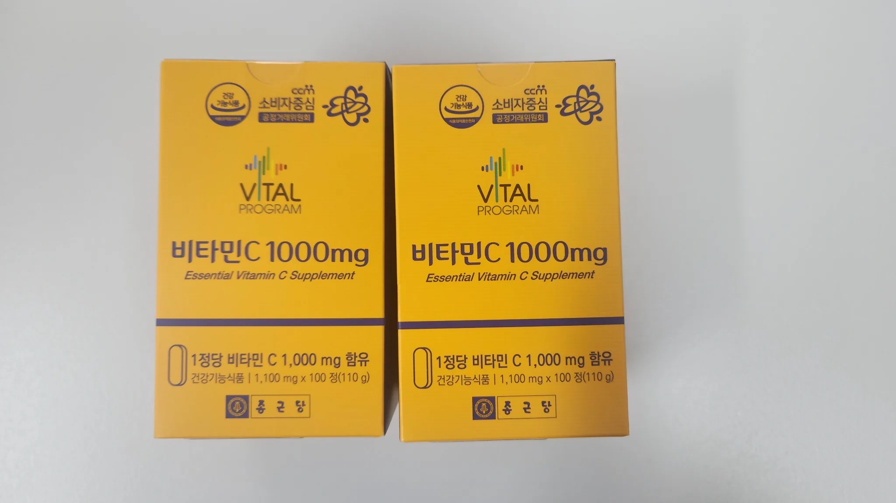
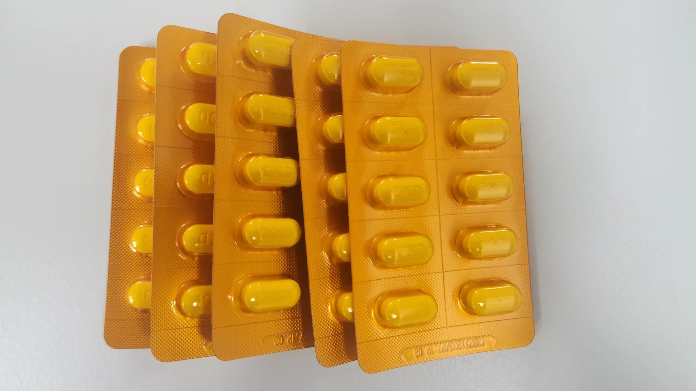

import CoupangDisclosure from '../../../components/CoupangDisclosure.astro';
import CoupangLink from '../../../components/CoupangLink.astro';

<CoupangDisclosure />

## 비타민C 뭐 사야 할지 진짜 모르겠더라고요

인스타에서 비타민C 3000mg 메가도스 보고 나도 살까 고민했어요.

근데 뭔가 찝찝했거든요. 권장량 100mg인데 30배를 먹는다고?

그래서 직접 찾아봤어요

결론부터 말하면요.

**3000mg은 위험해요.** 신장결석 위험 2배, 흡수율은 50%밖에 안 돼요.

**500-1000mg이면 충분합니다.** 그것도 제품 잘 골라야 해요.

어떻게 알았냐고요? 지금부터 보여드릴게요.

---

## 3000mg이 왜 위험한지 논문 찾아봤어요

**JAMA 2013년 연구** 찾았어요. 23,355명을 11년간 추적한 대규모 연구예요.

결과가 충격적이더라고요:

- 1000mg 복용자: **신장결석 2배** (1.92배 증가)
- 3000mg: 흡수율 **50%** (절반은 소변으로)
- 혈중 농도: 500mg이나 3000mg이나 **비슷함**

**쉽게 말하면:**
3000원짜리 먹으나 1000원짜리 먹으나 몸에 들어가는 양은 비슷한데, 신장에 부담만 줄 수 있다는 거죠.

> 더 자세한 내용: [비타민C 메가도스 3000mg 위험성](/blog/vitamin-c-megadose-3000mg-risk/)

**그럼 얼마를 먹어야 할까요?**

---

## NIH 연구 찾아보니 200-500mg이 최적이더라고요

**NIH(미국 국립보건원) 1996년 연구** 읽어봤어요.

7명을 4-6개월간 입원시켜서 30mg부터 2500mg까지 다 먹여본 실험이에요. 진짜 제대로 한 연구죠.

| 용량 | 흡수율 | 혈중 농도 | 소변 배출 | 내 평가 |
| --- | --- | --- | --- | --- |
| 200mg | **100%** | 포화 직전 | 거의 없음 | ⭐ 최적 |
| 500mg | 70% | 충분 | 약간 | ✅ 좋음 |
| 1000mg | 50% | 추가 상승 제한적 | 많음 | ⚠️ 주의 |
| 3000mg | 50% | 거의 차이 없음 | 대량 | ❌ 위험 |

**NIH 연구팀 결론:**
> "200mg이 생체이용률 100%로 최적 용량이다"

**내 결론:**
500-1000mg이면 충분한데, 어차피 먹을 거면 **흡수 잘 되는 제품**을 골라야겠더라고요.

---

## 제품 고를 때 내가 본 3가지

### 1. 용량 (500-1000mg)
- 너무 적으면 (200mg 이하): 여러 번 먹어야 함
- 너무 많으면 (2000mg 이상): 위험 + 낭비

### 2. 흡수 기술
리포솜 > 서방형 > 일반 순으로 좋더라고요.

**리포솜**: 흡수율 1.77배 (PMC 2016년 연구)  
**서방형**: 6-8시간 천천히 흡수  
**일반**: 한 번에 흡수 후 배출

### 3. 가성비
- 1일 비용 1000원 이하
- 리뷰 1만 개 이상
- 별점 4.5 이상

**근데요,** 조건 맞는 제품이 생각보다 많지 않더라고요.

결국 **5개로 추렸어요.**

---

## 내가 고른 제품 5개 솔직 비교

> 💰 **가격 정보**: 2026년 2월 3일 작성일 기준입니다. 실시간 가격은 링크에서 확인하세요.

### 1. 고려은단 비타민C 1000

쿠팡에서 가장 많이 팔리는 제품. 21만 개 리뷰.

**스펙:**
- 용량: 180정 (6개월분)
- 함량: 1000mg
- 가격: 17,900원
- **1일 비용: 99원**
- 리뷰: ⭐ 5.0 (21만 개)

**내가 본 장점:**
- ✅ **가성비 최고** - 정당99원
- ✅ 영국산 비타민C 원료
- ✅ 리뷰 "감기 덜 걸림" 51%
- ✅ 대용량 (6개월분)

**솔직한 단점:**
- ❌ 일반 정제 (서방형 아님)
- ❌ 1000mg 한 번에 먹으면 흡수율 50%
- ❌ 공복에 먹으면 속쓰림

**내 생각:**
반으로 쪼개서 아침 500mg + 저녁 500mg 먹으면 가성비 최고예요.

<CoupangLink
  title="고려은단 비타민C 1000 180정"
  url="https://link.coupang.com/a/dE9xvn"
  description="6개월분 대용량, 하루 99원. 반으로 쪼개면 흡수율도 챙길 수 있어요"
/>

---

### 2. 종근당 바이탈프로그램 1000mg

서방형 찾다가 발견한 제품이에요. 가성비 + 흡수율 모두 잡았더라고요.

**스펙:**
- 용량: 200정 (6-7개월분)
- 함량: 1000mg (서방형)
- 가격: 11,300원
- **1일 비용: 57원**
- 리뷰: ⭐ 5.0 (6만 개)

**서방형이 뭐길래?**

일반: 1시간 만에 흡수 → 6시간 뒤 소변으로  
**서방형**: 6-8시간 천천히 흡수 → 오래 유지

**내가 본 장점:**
- ✅ **가성비 최고** (57원/일)
- ✅ 서방형이라 한 번에 먹어도 OK
- ✅ 위 자극 적음
- ✅ 제약사 신뢰도

**솔직한 단점:**
- ❌ 리포솜보단 흡수율 낮음

**내 생각:**
하루 1번만 먹고 싶으면 이게 답이에요. 가격도 저렴하고요.

<CoupangLink
  title="종근당 바이탈프로그램 비타민C 1000mg 200정"
  url="https://link.coupang.com/a/dE9FQI"
  description="서방형으로 6-8시간 천천히 흡수. 하루 57원, 가성비 + 흡수율 모두 잡음"
/>

---

### 3. 일양약품 리포솜 비타민C 골드스틱

리포솜 제품 찾다가 제약사 제품 발견했어요.

**스펙:**
- 용량: 30포 (1개월분)
- 함량: 500mg (리포솜)
- 가격: 21,900원
- **1일 비용: 730원**

**리포솜이 뭐길래?**

PMC 2016년 연구:
- 일반 비타민C 대비 **최대 혈중 농도 +27%**
- 24시간 체내 노출 **+20%**
- **흡수율 1.77배**

**내가 본 장점:**
- ✅ **흡수율 1.77배** (과학적 검증)
- ✅ 일양약품 제약사 신뢰도
- ✅ 리포솜 중 가장 저렴
- ✅ 스틱형 휴대 편함

**솔직한 단점:**
- ❌ 가격 비쌈 (고려은단의 7배, 종근당의 13배)
- ❌ 리포솜 검증 자료 공개 여부 불명

**내 생각:**
리포솜 궁금하면 이게 가장 합리적인 선택이에요.

<CoupangLink
  title="일양약품 리포솜 비타민C 골드스틱 30포"
  url="https://link.coupang.com/a/dFanWg"
  description="제약사 리포솜 제품, 흡수율 1.77배. 스틱형으로 휴대 편함"
/>

---

### 4. 나우푸드 C-1000

해외 유명 브랜드 제품이에요. 250정 대용량.

**스펙:**
- 용량: 250정 (8개월분)
- 함량: 1000mg [+ 로즈힙]
- 가격: 22,480원
- **1일 비용: 90원**

**내가 본 장점:**
- ✅ **가성비 최고** (90원/일)
- ✅ 해외 유명 브랜드 NOW FOODS
- ✅ 8개월분 대용량
- ✅ 로즈힙 포함

**솔직한 단점:**
- ❌ 일반 정제 (서방형 아님)
- ❌ 알약 크기 큼 (해외 제품 특성)
- ❌ 한국어 설명 부족

**내 생각:**
해외 브랜드 선호하고 가성비 중시하면 좋아요. 고려은단보다 더 저렴해요.

<CoupangLink
  title="나우푸드 C-1000 타블렛 250정"
  url="https://link.coupang.com/a/dFavEi"
  description="해외 베스트셀러, 250정 대용량으로 하루 90원. 8개월분"
/>

---

### 5. 유유제약 NCI200 퓨어 비타민C

NIH 최적 용량 200mg 그대로 만든 제품이에요.

**스펙:**
- 용량: 60캡슐 (2개월분)
- 함량: **200mg** (천연 암라 추출)
- 가격: 23,000원 (약국)
- **1일 비용: 383원**
- 제형: 캡슐형

**왜 200mg?**

NIH 연구: "200mg이 흡수율 100%로 최적 용량"

**내가 본 장점:**
- ✅ 과학적 최적 용량
- ✅ 천연 암라 추출물 (플라보노이드 포함)
- ✅ 캡슐형으로 위 자극 없음
- ✅ 국내 제약사 품질

**솔직한 단점:**
- ❌ 가격 대비 함량 낮음
- ❌ 200mg이라 여러 번 먹어야 함
- ❌ 1일 비용 가장 비쌈 (646원)

**내 생각:**
위가 많이 약하거나 적은 용량만 원하면 좋은데, 솔직히 가성비는 별로예요.

<CoupangLink
  title="유유제약 퓨어비타민C, 60정"
  url="https://link.coupang.com/a/dFbLQs"
  description="NIH 연구 기반 200mg 최적 용량. 천연 암라 추출, 캡슐형"
/>

---

## 500mg vs 1000mg 뭘 사야 할까?

진짜 고민 많이 했어요. 결론은:

### 500mg 추천 이유
- 흡수율 70% (350mg 실제 흡수)
- 하루 2번 먹으면 **700mg 흡수**
- 1000mg 1번 (500mg 흡수)보다 효율적

### 1000mg 괜찮은 경우
- **서방형이면 OK** (종근당, 나우푸드)
- 하루 1번만 먹고 싶을 때
- 귀찮은 거 싫어하는 분

**내 선택:**
귀찮아서 종근당 서방형 1000mg 먹어요. 아침에 1알만 먹으면 되니까요.

---

## 천연 vs 합성, 진짜 차이 있나요?

이것도 논문 찾아봤어요.

**Linus Pauling Institute 2025년 연구:**
- 천연(아세로라) vs 합성 아스코르브산
- **흡수율 동일**

| 구분 | 천연 | 합성 |
| --- | --- | --- |
| 흡수율 | 동일 | 동일 |
| 가격 | 2-3배 비쌈 | 저렴 |
| 함량 | 낮음 (500mg 이하) | 높음 가능 |
| 추가 성분 | 플라보노이드 | 순수 비타민C |

**내 결론:**
플라보노이드 원하면 비타민C + 플라보노이드 **따로** 먹는 게 훨씬 효율적이에요.

천연이라고 2배 비싼 거 살 필요 없어요.

---

## 언제 먹어야 효과 좋아요?

### 최적 시간
**아침 식후 30분 (필수)**
- 하루 종일 항산화
- 철분 흡수 도움
- 에너지 대사

**저녁 식후 (추가 권장)**
- 하루 2번 나눠 먹으면 흡수율 유지
- 밤새 면역 기능

**⚠️ 공복은 피하는 게 좋아요**
- 속쓰림, 설사 위험
- 리뷰에서 가장 많이 본 부작용

### 함께 먹으면 좋은 것
✅ **비타민E**: 항산화 시너지  
✅ **철분**: 흡수율 2-3배 (여성)  
✅ **콜라겐**: 합성 도움

### 피해야 할 조합
❌ **커피**: 1시간 간격 (배출 촉진)  
❌ **우유**: 30분 간격 (칼슘이 방해)  
❌ **고용량 한 번에**: 나눠 먹기

---

## 상황별 내 추천

### 💰 가성비 최우선
**1위:** 종근당 바이탈프로그램 (57원/일)
- 서방형이라 흡수율도 챙김
- 하루 1번만 먹으면 됨

**2위:** 고려은단 (99원/일)
- 반으로 쪼개면 가성비 최고
- 국민 선택

### 🔬 흡수율 최우선
**1위:** 일양약품 리포솜 (1.77배)
- 전자현미경 검증
- 위 자극 없음

**2위:** 종근당 서방형
- 가성비 + 흡수율

### 🏥 위장 약한 분
**1위:** 일양약품  리포솜
**2위:** 유유제약 NCI200 (캡슐)
**3위:** 종근당 서방형

### ⏰ 귀찮은 거 싫어하는 분
**1위:** 종근당 바이탈 (하루 1번)
**2위:** 나우푸드 (하루 1번)

---

## 주의사항 (꼭 보세요)

### 이런 분은 의사와 상담
- ⚠️ 신장 질환, 신장결석 병력
- ⚠️ G6PD 결핍증
- ⚠️ 통풍, 혈색소증
- ⚠️ 임신/수유 중

### 이런 증상 있으면 즉시 병원
- 옆구리 극심한 통증
- 소변에 피
- 배뇨 시 심한 통증

> 더 자세한 위험성: [비타민C 메가도스 3000mg 위험](/blog/vitamin-c-megadose-3000mg-risk/)

---

## 내 최종 결론

| 상황 | 추천 | 이유 |
| --- | --- | --- |
| **가성비** | 종근당 바이탈 | 57원/일 + 서방형 |
| **흡수율** | 일양약품 리포솜 | 1.77배 |
| **위장 약함** | 일양약품 리포솜 | 위 자극 없음 |
| **국민 선택** | 고려은단 | 21만 리뷰 |
| **해외 브랜드** | 나우푸드 | 로즈힙 포함 |

**핵심 정리:**

✅ 안전 용량: 500-1000mg  
✅ 3000mg은 위험 (신장결석 2배)  
✅ 흡수율: 리포솜 > 서방형 > 일반  
✅ 복용법: 식후 30분, 하루 2번 나눠 먹기

---

## ++ 📦 도착했어요!

역시 쿠팡 바로 도착해서 사진 첨부합니다.

종근당 바이탈프로그램으로 구매 했습니다. 가성비 + 흡수율 모두 잡았거든요.

이제 꾸준히 먹어보고, 효과 있으면 업데이트할게요!

---

## 참고한 논문

1. [Levine M, et al. 비타민C 약동학. Proc Natl Acad Sci USA. 1996](https://www.pnas.org/doi/pdf/10.1073/pnas.93.8.3704)
2. [Thomas LDK, et al. 비타민C와 신장결석. JAMA Intern Med. 2013](https://jamanetwork.com/journals/jamainternalmedicine/fullarticle/1568519)
3. [Davis JL, et al. 리포솜 비타민C 흡수율. Nutr Metab Insights. 2016](https://pmc.ncbi.nlm.nih.gov/articles/PMC4915787/)